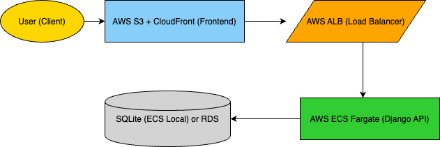

# Quiz App - Full Stack Deployment (Django + React)

## Live Application

- **Frontend URL**: [http://3.227.254.119:3000/register](http://3.227.254.119:3000/register)
- **Backend URL**: [http://35.175.210.19:8000](http://35.175.210.19:8000)

---

## Tech Stack

- React (Frontend)
- Django (Backend)
- Docker (Containerization)
- AWS ECS Fargate (Deployment)
- GitHub Actions (CI/CD)
- SQLite (Database)
- JWT (Authentication)

---

## Backend API Overview

#### Quiz and Question Endpoints

        Quizzes
        
                * `GET /quiz/quizzes/` – List all quizzes
                * `POST /quiz/quizzes/` – Create a new quiz
                * `GET /quiz/quizzes/<id>/` – Get a quiz by ID
                * `PATCH /quiz/quizzes/<id>/` – Update a quiz’s title or description
                * `DELETE /quiz/quizzes/<id>/` – Delete a quiz (creator only)
        
        Questions
        
                * `GET /quiz/questions/` – List all questions
                * `POST /quiz/questions/` – Create a new question with choices
                * `PATCH /quiz/questions/<id>/` – Update question text or choices
                * `DELETE /quiz/questions/<id>/` – Delete a question
        
        
        Key Functional Features
        
                * Create quizzes with nested questions and single/multiple correct choices
                * Role-based permissions: quiz creators can edit/delete, others can only attempt
                * Inline frontend editing of quiz metadata and questions
                * Scoring handled client-side (no answer submission endpoint)

> **Tested using Postman**

---

## Security

- All sensitive routes are **protected via JWT Authentication**
- Tokens must be included in headers: `Authorization: Bearer <token>`
- CORS also implemented with Django REST Framework

---

## Continuous Integration (CI/CD)

GitHub Actions automates the following on each push to `main` branch:

-  Builds Docker images for `frontend` and `backend`
-  Pushes images to Docker Hub or ECR
-  Updates ECS task definitions manually (can be automated further)

---

## Docker Usage

- Each component (frontend & backend) is containerized using Docker.
- Containers are deployed on ECS **Fargate** (serverless containers, no EC2 hardware).

---

## Security Features

- JWT-based authentication
- CORS Implementation
- Private Docker images in ECR
- No hardcoded secrets
- Access to backend is via public IP and protected endpoints

---

## Architecture Diagram



---

## Repository Structure

```
API-Applicaiton/                      
│── backend/                   
│   ├── quiz/              # Main Django app
|   │   ├── quiz/              
|   │   │   ├── __init__.py
|   │   │   ├── settings.py        
|   │   │   ├── urls.py            
|   │   │   ├── wsgi.py            
|   │   │   ├── asgi.py            
|   │   ├── quiz-api/
|   │   |   ├── tests/test_api.py              
|   │   │   ├── __init__.py
|   │   │   ├── settings.py        
|   │   │   ├── urls.py            
|   │   │   ├── wsgi.py            
|   │   │   ├── asgi.py               
|   │   │   ├── models.py               
|   │   │   ├── urls.py               
|   │   │   ├── views.py               
│   │── manage.py              # Django CLI
│   ├── requirements.txt       # Backend dependencies
│   ├── Dockerfile             # Docker configuration for backend│
│── frontend/                  
│   ├── public/                
│   │   ├── index.html
│   │   ├── manifest.json
│   │   ├── robots.txt
│   ├── src/                   
│   │   ├── components/        
│   │   │   ├── QuestionForm.js
│   │   │   ├── QuizList.js
│   │   ├── pages/             
│   │   │   ├── Register.js
│   │   │   ├── Login.js
│   │   │   ├── QuizPage.js
│   │   ├── App.js             # Main App component
│   │   ├── index.js           # React entry point
│   ├── package.json           # Frontend dependencies
│   ├── Dockerfile             # Docker configuration for frontend
│
│
|── README.md            
│── .gitignore                

```

---

Directions to run the project

- Open one terminal for backend api and go to the backend folder
        cd backend/

- Install all the dependencies using requirements.txt file
        pip install -r requirements.txt

- Then go to the quiz app
        cd quiz/

- Activate the virtual environment by typing the following command on the prompt 

          source env/bin/activate

- Run the python server with the following command

          python manage.py runserver

# Getting Started with Frontend Quiz App

- Open a new terminal for frontend, go into the folder and run **npm install** to install all the dependencies
  
          cd frontend
          npm start
Running Backend Tests

        python manage.py test backend/quiz/quiz_api.tests

Test database is used for isolation. Activate your virtual environment before running.


## Author

**Shubh Sanghvi**  
Deployed and submitted on: **March 23, 2025**
